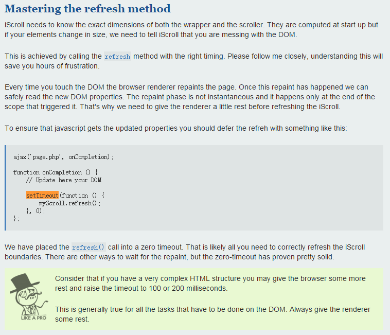

#setTimout( , 0)

##一、前言

前端工程师们工作久了，一般都会在某些地方看见过这样的代码：

```javascript
setTimeout(function(){
	// TODO
}, 0);
```

举个实例，移动端我们经常会用的一个库叫做iScroll来模仿iOS系统里面的滚动反弹效果，而它的[官方文档](http://iscrolljs.com/)里面就有类似的代码建议：



上面其实也说到了setTimeout( , 0)的作用，就是当你改动了DOM后，让浏览器有一点空余的时间来重绘这个页面。可能道理大家都懂，但是为什么啊？？下面让我们通过实例来研究说明setTimeout(, 0)的工作原理。


##二、stackoverflow解释翻译[（原文地址）](http://stackoverflow.com/questions/779379/why-is-settimeoutfn-0-sometimes-useful)

###stackoverflow是程序员的好基友，因此我在那里翻到了这个解释，并且对其进行了中文翻译，英语好的同学可以直接到上面原文地址里查看。整个解释非常的详细：

> 想象一下页面中有一个 ”do something“ 按钮和一个显示结果的 DIV。
>
> ”do something“ 按钮中点击事件`onclick`的回调函数 ”LongCalculate()“ 中干了两件事：
>
> 1. 执行一个非常耗时的计算（大约3分钟）。
> 2. 把上面计算的结果输出到结果 DIV 里面。
>
> 现在，你的用户开始测试这个功能，点击 “do something” 按钮，接着页面就似乎在3分钟内什么也没干，用户烦躁不安，再次点了一下按钮，又等了一分钟，也是什么都没有发生，然后再次点击了按钮。。。
>
> 问题很明显：你需要有一个“状态” DIV，用来展示现在进行的情况。下面展示的最新的处理。
>
> ***
>
> 所以你添加了一个“状态” DIV（刚开始是空的），接着调整`onclick`的回调函数（函数`LongCalc()`），调整后该回调函数执行以下4个步骤：
>
> 1. 改变状态 DIV 的内容为 “Calculating... may take ~3 minutes” 。
> 2. 执行一个非常耗时的计算（大约3分钟）。
> 3. 把上面计算的结果输出到结果 DIV 里面。
> 4. 改变状态DIV的内容为 “Calculation done”。
>
> 修改完毕，你兴高采烈地叫你的用户再来测试以下。
>
> 他们满脸不爽的又走过来说，他们点击按钮的时候，状态 DIV 根本都不会显示 "Calculation..." 这个状态！！！
>
> ***
>
> 你绞尽脑汁，万思不得其解。到 StackOverflow疯狂提问（或者阅读文档和问Google），接着你发现问题所在了：
>
> 浏览器把所有事件触发的待执行任务（ UI 任务和 JavaScript 命令）都放到**同一个队列**里面。并且不幸的是，重绘状态 DIV 的内容为 ”Calculating...“ 是一个分离的待执行任务，这个任务会放到队列的最后面！
>
> 下面是你的用户测试过程中的事件分解和队列中的内容：
>
> * 队列：`[Empty]`
> * 事件：点击按钮。事件触发后队列的内容：`[Execute OnClick handler(line 1-4)]`
> * 事件：执行回调函数的第一行代码（也就是改变状态 DIV 的值）。事件触发后队列的内容：`[Execute OnClick handler(lines 2-4), re-draw Status DIV with new "Calculating" value]`。**请注意当DOM元素改变的瞬间，需要一个新的事件来重绘这个DOM。这个事件通过改变DOM元素触发，并且会被放到队列的最后面。**
> * **注意！！！注意！！！**下面详细解释
> * 事件：执行回调函数的第二行代码（耗时的计算）。事件触发后队列的内容：`[Execute OnClick handler(lines 3-4), re-draw Status DIV with "Calculating" value]`。
> * 事件：执行回调函数的第三行代码（计算结果输出到结果 DIV ）。事件触发后队列的内容：`[Execute OnClick handler(line 4), re-draw Status DIV with "Calculating" value, re-draw result DIV with result]`。
> * 事件：执行回调函数的第四行代码（结果 DIV 的状态改为 “DONE” ）。事件触发后队列的内容：`[Execute OnClick handler, re-draw Status DIV with "Calculating" value, re-draw result DIV with result; re-draw Status DIV with "DONE" value]`。
> * 事件：执行回调函数隐含的`return`。从队列中移除 “Execute OnClick handler”，然后执行队列中的下一个任务。
> * 注意：由于我们已经完成了计算，3分钟已经过去。**重绘事件还没有发生！！！**
> * 事件：重绘状态 DIV 的内容为 “Calculating” 。把这个重绘任务从队列中去掉。
> * 事件：使用计算的结果重绘结果 DIV 。把这个重绘任务从队列中去掉。
> * 事件：重绘状态 DIV 为 “Done”。把这个重绘任务从队列中去掉。眼尖的读者可能注意到在**计算完结之后** “Calculating” 在微秒之间一闪而过。
>   因此，潜在的问题就是重绘状态 DIV 这个事件被放到了队列的最后，放到了耗时3分钟的计算后面，所以这个重绘在计算完成前都没有执行。
>
> ***
>
> 要解决这个问题，就要使用`setTimeout()`了。那么怎样解决？因为通过`setTimeout`调用需要长时间执行的代码的时候，其实是创建了两个事件：`setTimeout`自身的执行事件，和之后才进队列的代码执行事件。（由于 0 秒 timeout）
>
> So, to fix your problem, you modify your `onClick` handler to be TWO statements (in a new function or just a block within `onClick`)：
>
> 1. 改变状态 DIV 的内容为 “Calculating... may take ~3 minutes” 。
>
> 2. **执行`setTimeout()`，在0秒后执行`LongCalc()`函数。**
>
>    `LongCalc()`函数基本上和上面的一样，但明显地，不用再在里面改变状态 DIV 的内容为 “Calculating” ，而且计算也不会立刻执行。
>
> 所以呢，现在的事件顺序和队列会变成怎样呢？
>
> * 队列：`[Empty]`
> * 事件：点击按钮。事件触发后队列的内容：`[Execute OnClick handler(status update, setTimeout() call)]`
> * 事件：执行onclick回调函数中的第一行（改变状态 DIV 的值）。事件触发后队列的内容：`[Execute OnClick handler(which is a setTimeout call), re-draw Status DIV with new "Calculating" value]`。
> * 事件：执行onclick回调函数中的第二行（执行 setTimeout ）。事件触发后队列的内容：`[re-draw Status DIV with "Calculating" value]`。队列在0+秒内不会有新事件入栈。
> * 事件：0+秒之后timeout计时器完成计时。事件触发后队列的内容：`[re-draw Status DIV with "Calculating" value, execute LongCalc (lines 1-3)]`。
> * 事件：重绘状态 DIV 的内容为 ”Calculating“。事件触发后队列的内容：`[execute LongCalc (lines 1-3)]`。注意，这次的重绘事件可能会在timeout计时器完成计时之前执行，不过这没关系。
> * ...
>   万岁 ! 状态 DIV 在执行计算前成功更新为 “Calculating...” !!!
>
> 下面是JSFiddle中解释这个例子的代码：http://jsfiddle.net/C2YBE/31/
>
> **HTML code:**
>
> ```html
> <table border=1>
>     <tr><td><button id='do'>Do long calc - bad status!</button></td>
>         <td><div id='status'>Not Calculating yet.</div></td>
>     </tr>
>     <tr><td><button id='do_ok'>Do long calc - good status!</button></td>
>         <td><div id='status_ok'>Not Calculating yet.</div></td>
>     </tr>
> </table>
> ```
>
> **JavaScript code: (Executed on onDomReady and may require jQuery 1.9)**
>
> ```javascript
> function long_running(status_div) {
>
>     var result = 0;
>     // Use 1000/700/300 limits in Chrome, 
>     //    300/100/100 in IE8, 
>     //    1000/500/200 in FireFox
>     // I have no idea why identical runtimes fail on diff browsers.
>     for (var i = 0; i < 1000; i++) {
>         for (var j = 0; j < 700; j++) {
>             for (var k = 0; k < 300; k++) {
>                 result = result + i + j + k;
>             }
>         }
>     }
>     $(status_div).text('calclation done');
> }
>
> // Assign events to buttons
> $('#do').on('click', function () {
>     $('#status').text('calculating....');
>     long_running('#status');
> });
>
> $('#do_ok').on('click', function () {
>     $('#status_ok').text('calculating....');
>     // This works on IE8. Works in Chrome
>     // Does NOT work in FireFox 25 with timeout =0 or =1
>     // DOES work in FF if you change timeout from 0 to 500
>     window.setTimeout(function (){ long_running('#status_ok') }, 0);
> });
> ```


##三、结合Timeline工具分析

上面的解释已经很清楚了，但还是有点抽象。为了更进一步的加深对这个原理的理解，我个人使用Chrome的Timeline工具再进行一次分析，也看看有没有什么新的发现。

为了使数据更加清晰，我把上面js中的jQuery代码都更换为原生的api。流程内容其实什么都没有改变：

```javascript
var status_ok = document.getElementById('status_ok');
var do_ = document.getElementById('do');
var status = document.getElementById('status');
var do_ok = document.getElementById('do_ok');

function long_running(status_div) {

    var result = 0;
    // Use 1000/700/300 limits in Chrome, 
    //    300/100/100 in IE8, 
    //    1000/500/200 in FireFox
    // I have no idea why identical runtimes fail on diff browsers.
    for (var i = 0; i < 1000; i++) {
        for (var j = 0; j < 700; j++) {
            for (var k = 0; k < 300; k++) {
                result = result + i + j + k;
            }
        }
    }
    document.getElementById(status_div).innerText = 'calclation done';
}

// Assign events to buttons
do_.onclick = function() {
    status.innerText = 'calculating....';
    long_running('status');
};

do_ok.onclick = function() {
    status_ok.innerText = 'calculating...';
    window.setTimeout(function() {long_running('status_ok')}, 0);
};
```

接下来再放上Timeline的两张事件记录图，左边为没有使用setTimeout的，右边为使用了setTimeout的：

                               

先看看没有使用setTimeout时的事件记录：

1. 触发点击事件。
2. 执行点击事件的回调函数。注意，这一步已经包括耗时的计算代码了。
3. **只一次Layout事件和Paint事件！**，而触发这些事件的代码为：`document.getElementById(status_div).innerText = 'calclation done';`。

这份记录和stackoverflow中的解释基本吻合，但还记得上面说过这样一句吗：

> 眼尖的读者可能注意到在**计算完结之后** “Calculating” 在微秒之间一闪而过。

实际情况是用户永远没可能看到 “Calculating” 这个状态，因为浏览器的优化功能，把两个重绘操作合并成一个了。

***

接下来看看使用了setTimeout的情况：

1. 触发点击事件
2. 执行点击事件的回调函数。
3. 设置一个Timer。这里可以看出执行setTimeout的时候会设置一个Timer，setTimeout的回调函数，只有当这个Timer完成倒计时才会执行回调函数。
4. 执行由代码`status_ok.innerText = 'calculating...';`引起的重绘操作。
5. Timer计时器倒计时完毕，执行里面的计算代码。
6. 计算完成后，执行由代码`document.getElementById(status_div).innerText = 'calclation done';`引起的重绘操作。

因此，我们就可以很确定的说，setTimeout( , 0)的作用其实就是在进行复杂计算前，腾出一点时间让浏览器可以完成重绘相关的Layout、Paint等操作。


##四、setTimeout( ,0)能百分百解决问题吗？

不知道大家看到这里有没有这样一个疑问：setTimeout( ,0)腾出的时间一定足够让浏览器执行Layout、Update Layer Tree和Paint等一连串的动作吗？**先给出一个答案，不一定！**

在这里我继续抛出一张图，这张图是我用上面一模一样的代码记录出来的（使用setTimeout的情况下）：

 

大家注意到红框里面的内容了吗，浏览器要绘制 “calculating...” 的最后一步Paint事件前，Timer计时器倒计时完毕，执行计算代码了！所以最终都没有Paint出来！执行完计算之后，直接合并重绘操作，显示内容 “calclation done” 了。所以这次即使是用了setTimeout( , 0)我也是看不到 “calculating...” 这个状态的。

所以为了保证每次的显示效果都正常，大家可以把setTimeout( , 0)中的倒计时间设置更久，例如20、30又或者200、300。具体应该是多少需要根据我们重绘DOM的复杂程度来决定。

其实上面我给出的iScroll文档说明中也说明过这个问题：

>Consider that if you have a very complex HTML structure you may give the browser some more rest and raise the timeout to 100 or 200 milliseconds.
>
>This is generally true for all the tasks that have to be done on the DOM. Always give the renderer some rest.


##五、总结

**最后的总结：使用setTimeout( , 0)可以让我们在进行复杂运算前腾出时间，使浏览器完成渲染页面相关的操作。进行复杂的渲染时，也要相对的把倒计时的时间延长，以保证有足够的时间。**

（大家还可以到我的[Github](https://github.com/oadaM92/oadaM92-blog/tree/master/blogs/2016-03-21-setTimout(0))上面获得更好的阅读体验，因为博客园的markdown样式太丑了。。。）

（如果对这篇文章有疑问，大家可以在下面评论，我会尽快给出答复。）


